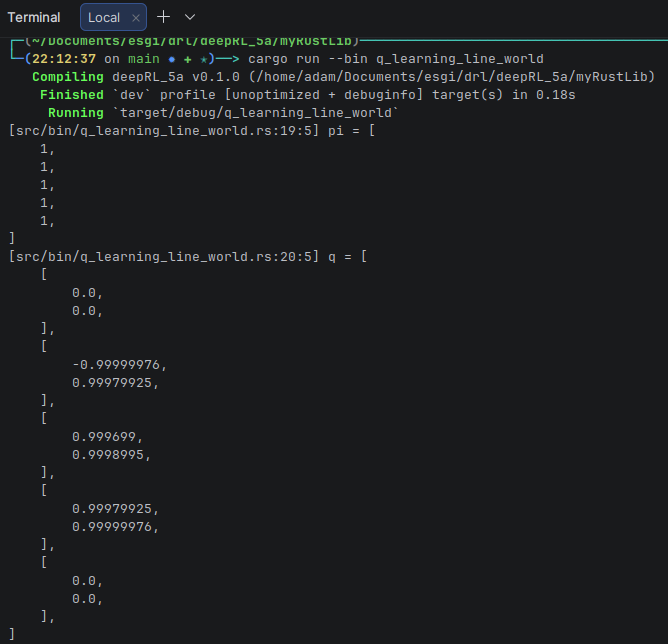

# Suivie des tâches quotidiennement

### 03/02
- Line_world implementation
- q_learning implementation
- test q_learning sur line world
  - 
  - p optimal trouvé, toujours aller a droit
  - q optimal trouvé (~), plus on s'approche de droit plus la récompense est élevé, (a droit 1, à gauche -1)
